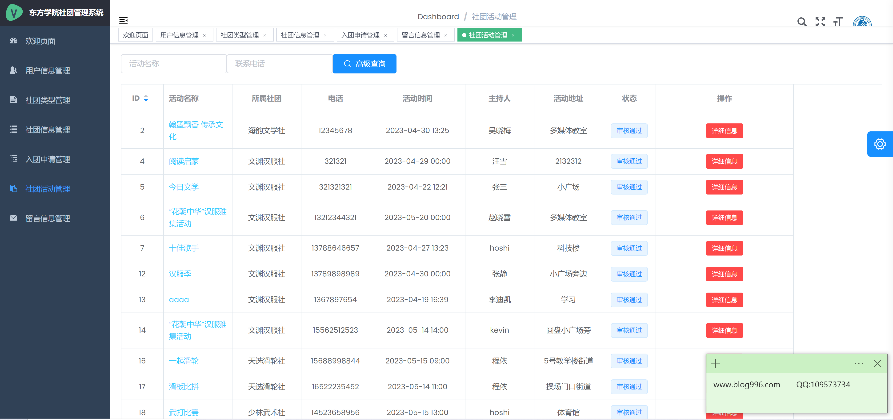

<h1 align="center">大学社团管理系统</h1>

## 简介
大学社团管理系统：角色分为管理员、用户；提供用户信息管理、社团信息管理、入团申请管理、社团活动管理、在线联系等功能，简化社团管理流程。    --计算机毕业设计源码；毕设源码；java毕业设计源码

## 联系方式

<h3 align="center">获取完整代码与数据库文件 + 微信：deepguan QQ: 86050149 QQ群: 783742310</h3>

<h3 align="center">可帮忙远程部署 包运行成功！提供远程部署、修改代码、设计文档指导、代码讲解等服务！</h3>

## 功能介绍（完整见运行截图）
管理员：基本功能包括登录、用户信息管理、社团信息管理、入团申请管理、社团活动管理和留言信息管理等。页面设计简洁，功能明确。管理员可以通过系统后台对用户信息进行管理和操作，包括修改密码、编辑和删除用户信息。社团活动管理可进行活动的高级查询和详细信息查看，优化社团内部事务的组织与协调。

学生用户：可以使用系统进行个人信息的编辑与查看，并通过主页导航栏参与社团列表搜索、筛选和加入等功能。学生用户还能以申请者身份，通过入团申请界面提交详细的个人及申请信息。系统提供社团活动、通知和公告的查看功能，简化社团报名与管理流程，便于了解并参与社团活动。

申请者：申请者主要通过填写申请表来加入社团，提交的申请表单包括姓名、性别、联系方式、学院、年级、邮箱等信息。系统使申请者能够了解社团详情，支持查询和管理自己的申请。申请管理界面帮助管理员和申请者跟踪申请状态和进度。

联系管理员页面：用户可以填写姓名、电话、邮箱及申请内容的表单以联系系统管理员。提供电话、传真、邮箱和学院网站链接以获取更多信息或直接联系相关人员。页面设计提升了整体的专业度和信任度，便于用户快速解决问题并获取技术支持。

## 运行截图

本代码来源于网络,仅供学习参考使用!

